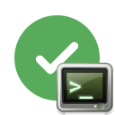

# Actionforge Graph Runner
<!-- markdownlint-disable MD033 -->

<div align="center" width="100%">
  

[](https://www.actionforge.dev/github/actionforge/graph-runner/main/.github/workflows/graphs/build-and-publish.yml)
[](https://www.python.org/)
[](https://www.github.com/actionforge/legal/blob/main/LICENSE.md)

</div>

The Graph Runner is a CLI tool and the core of the [Actionforge](https://actionforge.dev) project. It is designed for high-performance executions of action graphs.

## Usage

Use the `--help` option to get more details about the command their options.

```bash
graph-runner --help
```

### Execute a graph

The basic command to run an action graph is:

```bash
graph-runner run ./example-graph.yml
```

## Prerequisites

To run the Graph Runner, ensure you have Go installed. The required Go version is specified in the [go.mod](./go.mod) file. You can find the installation guidelines for Go [here](https://golang.org/doc/install).

Before running any commands, first install the necessary dependencies:

```bash
go mod tidy
```

## Compilation Instructions

Graph Runner offers two build options:

- **With GitHub Actions workflow support**:

  ```bash
  go build -o graph-runner .
  ```

- **Without GitHub Actions workflow support**:

  ```bash
  go build -tags=github_impl -o graph-runner .
  ```

### Development Environment: VS Code DevContainer

This project includes a VS Code DevContainer configuration. It pre-configures VS Code with all required tools and extensions for this project. To use this feature, install the [Dev Containers extension](https://marketplace.visualstudio.com/items?itemName=ms-vscode-remote.remote-containers). You can find a tutorial on how to use DevContainers [here](https://code.visualstudio.com/docs/devcontainers/tutorial).

## Testing Framework

The Graph Runner comes with three types of tests:

1. **Unit Tests**: For small individual functions and components, located in [/unit_tests/](./unit_tests/).
2. **Integration Tests**: For testing component interactions. These are `*_test.go` files outside the `unit_tests` directory.
3. **System Tests**: For testing the entire CLI functionality, located in [/system_tests/](./system_tests/).

Tests can be run in VS Code using CodeLens[^1] or through the following shell commands:

[^1]: CodeLens provides inline commands in VS Code, positioned above test functions.

### Running Tests

- **Unit Tests**:

  ```bash
  go test ./... -v -coverpkg=./... -cover -coverprofile cover.out --tags=unit_tests,github_impl
  ```

- **Integration Tests**:

  ```bash
  go test ./... -v -coverpkg=./... -cover -coverprofile cover.out --tags=integration_tests,github_impl
  ```

- **System Tests**:

  ```bash
  go test ./... -v -coverpkg=./... -cover -coverprofile cover.out --tags=integration_tests,system_tests,github_impl
  ```

- **All Tests**:

  ```bash
  go test ./... -v -coverpkg=./... -cover -coverprofile cover.out --tags=unit_tests,integration_tests,system_tests,github_impl

  # With race detection:
  go test ./... -v -race -coverpkg=./... -cover -coverprofile cover.out --tags=unit_tests,integration_tests,system_tests,github_impl
  ```

### Coverage Report

After running one or more tests, generate a coverage report in HTML format using the following command:

```bash
go tool cover -html cover.out -o cover.html
```

## Licensing

This software is licensed under the Actionforge Community License that you can find [here](https://github.com/actionforge/legal/blob/main/LICENSE.md).

Commercial licenses (including sublicensing) are available by email. [Get in touch](mailto:hello@actionforge.dev).
